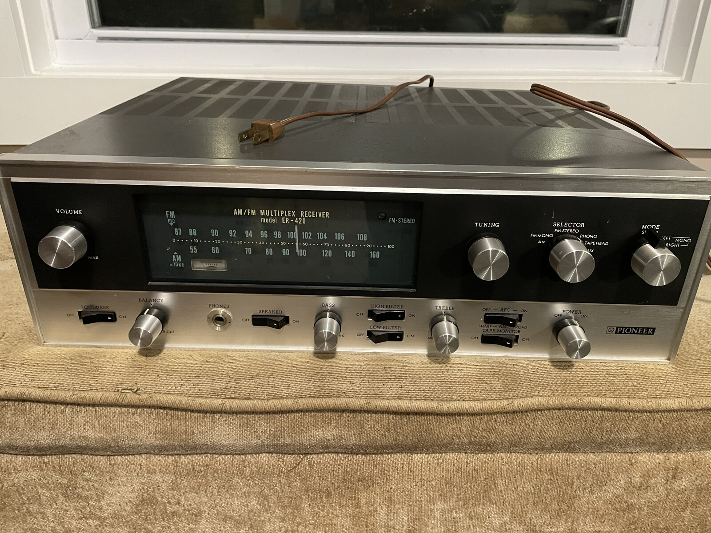
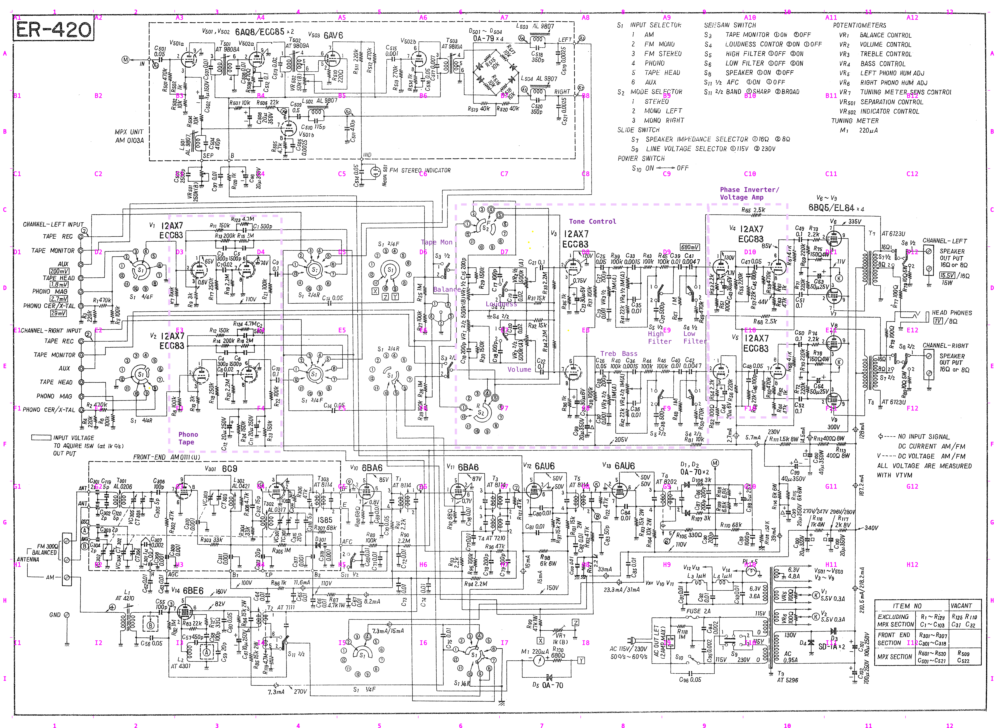

#+TITLE: Pioneer ER-420 Restoration
#+STARTUP: overview

1966 Pioneer ER-420, all-tube receiver. Recap and restoration.

I quite naively bought this amplifier off Facebook Marketplace. Here's the
backstory and [[file:history.org]]. My plan is to do a targeted recap of the oiled
paper and electrolyte capacitors and leave all the mylar, ceramic, and
polyethylene capacitors original. My primary use will be turntable. I'm actually
just going to focus on the AUX input signal path and not worry about the RF or
Phono inputs for now.

Current status: circuit tracing and orienting underway, nothing electrical replaced yet.

* Log

- [[file:log/2026-07-28-first-teardown.org][2026-07-28]]: Cover off, all caps discharged and verified, S7's rear switch diagnosed as a mechanical fix
- [[file:log/2026-07-28-schematic-extraction.org][2026-07-28]]: Schematic gridded and tiled at full resolution for reference
- [[file:log/2026-07-27-bom-and-project-setup.org][2026-07-27]]: Full BOM built from the service manual and reconciled against the first parts order
- [[file:log/2026-07-25-parts-research.org][2026-07-25]]: Recap strategy worked out, first Mouser order placed

* Start here

- [[file:er-420-restoration-plan.org]] — the living phase-by-phase plan; what's done and what's next
- [[file:schematic/ZONES.org]] — the schematic index; read before opening any image
- [[file:bom.org]] — one row per component; the file that makes review possible
- [[file:reference/pioneer_er-420_mpx_receiver_sm.pdf][Pioneer ER-420 Service Manual]] - a very good scan of the original service manual I found on the internet
-  - and some of my [[file:schematic/circuit-notes.org][notes]] as I work and explore
- [[file:food-for-thought.org]] — outside advice worth weighing, and where it landed
- =CLAUDE.md= — conventions, and how I want Claude to engage with this project

* Conventions

- Notes are org. =CLAUDE.md= is markdown because the filename is fixed.
- Photos: =YYYY-MM-DD-subject-NN.jpg=, referenced inline in the log entry that
  produced them. No separate photo index.
- Log files: =YYYY-MM-DD-topic.org=, five fixed headings, never restructured.
- Shoot far more "before" than feels necessary: wire dress, connector
  orientation, ground lug positions, every board before it is touched.
