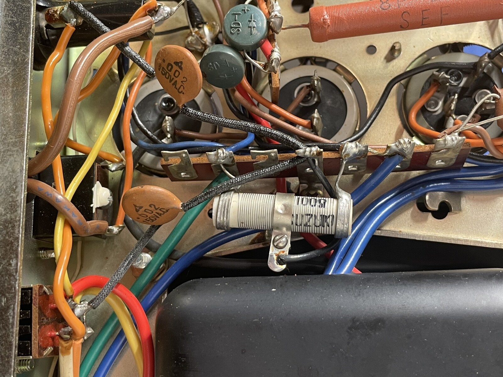

#+TITLE: ER-420 Component Notes
#+CATEGORY: er420
#+STARTUP: overview
#+FILETAGS: :audio:restoration:er420:

Per-component index — one heading per designator, for fast lookup at
the bench: what it does, and which photos it's been physically
identified in. Complements [[file:schematic/circuit-notes.org][circuit-notes.org]] rather than duplicating
it: that file is the subsystem-level investigation journal (the "how
did we figure this out" narrative); this file is the atomic "what do
I know about this one part" layer, same relationship circuit-notes.org
already has to [[file:schematic/ZONES.org][ZONES.org]]. Function lines here stay short and link back
to circuit-notes.org for the full story where one exists.

A heading here is what makes a component's Ref a link in bom.org — a
component doesn't need both Function and Photos filled in to earn a
heading, either is enough to be worth a lookup.

Add photo bullets with [[file:scripts/import-labels.sh][import-labels.sh]] after tagging a photo in
labelme; add Function lines by hand as circuit tracing turns them up.

* C94
Function: AC-line safety bypass cap, one leg to chassis. Physically
located near the fuse holder — see [[file:er-420-restoration-plan.org][restoration-plan.org]] Phase 2 for
the still-open Y2/X2/line-to-neutral trace question.

Photos:
- 

* C95
Function: AC-line safety bypass cap, paired with C94. Same open trace
question — see [[file:er-420-restoration-plan.org][restoration-plan.org]] Phase 2.

Photos:
- 

* C96
Function: arc-suppression cap bridging S10's switch contacts, not a
line-to-chassis safety cap as first guessed. Resin/film construction,
not oil-paper — decided not to replace. Full story in
[[file:schematic/circuit-notes.org][circuit-notes.org]] Power supply.

* C99
Function: one of two 3-section B+ filter/decoupling cans, cascaded
down the power supply's dropping-resistor chain rather than all three
sections tapping one node. Four terminals: one common/negative plus
one per section. Full trace in [[file:schematic/circuit-notes.org][circuit-notes.org]] Power supply.

* C100
Function: matches C99 — see that entry and
[[file:schematic/circuit-notes.org][circuit-notes.org]] Power supply.

Photos:
- 

* C101
Function: series voltage-doubler cap with C102, fed from T9's
dedicated 130V AC winding via D3/D4 — a separate, lower-current supply
from the main B+ chain. D3 lands on its hot ("+") side. Full topology
in [[file:schematic/circuit-notes.org][circuit-notes.org]] Power supply.

Photos:
- 

* C102
Function: the ground-referenced half of the C101/C102 doubler pair —
its negative terminal is where D4 lands. Confirmed as the rear-panel-
closest can, matching the manual's own layout diagram. See
[[file:schematic/circuit-notes.org][circuit-notes.org]] Power supply.

Photos:
- 

* D3
Function: doubler rectifier diode (SD-1A), feeds C101's hot side from
T9's 130V winding. Schematically at I11, off T9. Full trace in
[[file:schematic/circuit-notes.org][circuit-notes.org]] Power supply.

Photos:
- 

* D4
Function: doubler diode (SD-1A) paired with D3, grounds C102's
negative side. Same zone and story as D3 — see
[[file:schematic/circuit-notes.org][circuit-notes.org]] Power supply.

Photos:
- 

* S9
Function: rear-panel line voltage selector (115V/230V). The locking
plate pinning it to 115V is factory original, not a field addition —
see [[file:schematic/circuit-notes.org][circuit-notes.org]] Power supply for the patina/export-market evidence.

Photos:
- 

* T9
Function: main power transformer. Primary identified by tracing to
S9 (white/orange/yellow/red); everything else on the same physical
side is secondary despite the shared side — position alone doesn't
predict primary vs. secondary on this part. Full lead tracing in
[[file:schematic/circuit-notes.org][circuit-notes.org]] Power supply.

Photos:
- 

* VR5
Function: heater hum-balance pot for V1's heater supply — not
cathode-related despite a "(K)" schematic symbol that looks like it
should mean cathode. See [[file:schematic/circuit-notes.org][circuit-notes.org]] Power supply for why.

* VR6
Function: matches VR5, for V2's heater. See
[[file:schematic/circuit-notes.org][circuit-notes.org]] Power supply.

* R77
Function: 100Ω, part of the headphone-output divider with R79, tapping
in *before* S8 (speakers on/off) — the reason "speakers off" doesn't
create a true open-secondary condition on T7. See
[[file:schematic/circuit-notes.org][circuit-notes.org]] Output stage.

* R78
Function: right-channel mirror of R77, paired with R80 for T8. See
[[file:schematic/circuit-notes.org][circuit-notes.org]] Output stage.

* R79
Function: 16Ω wirewound (manual says 10Ω; physical part disagrees,
trusted) — dummy-load resistor keeping T7 loaded when S8 is off, part
of the same divider chain as R77. See
[[file:schematic/circuit-notes.org][circuit-notes.org]] Output stage.

* R80
Function: right-channel mirror of R79, for T8. See
[[file:schematic/circuit-notes.org][circuit-notes.org]] Output stage.

* T7
Function: left-channel output transformer. Primary leads (red/green)
traced directly to V6/V7 plate pins; no-load damage check came back
clean. See [[file:schematic/circuit-notes.org][circuit-notes.org]] Output stage.

* T8
Function: right-channel mirror of T7. See
[[file:schematic/circuit-notes.org][circuit-notes.org]] Output stage.

* C13
Function: 0.05µF oil-paper coupling cap in the Tape Monitor path via
S3 — was briefly suspected of being C96 before tracing ruled that out.
See [[file:schematic/circuit-notes.org][circuit-notes.org]] Tone/preamp.

* C14
Function: right-channel mirror of C13. See
[[file:schematic/circuit-notes.org][circuit-notes.org]] Tone/preamp.

* R73
Function: 2.2K grid resistor feeding V6's control grid (pin 2) from
the driver stage, alongside coupling cap C49.

* C49
Function: 0.1µF Mylar grid-coupling cap, driver stage to V6's grid —
the highest-consequence coupling position in the amp (leak here red-
plates an output tube directly). Tested clean 2026-07-29, in-circuit
DC leakage check.

* C50
Function: mirrors C49, feeds V7's grid. Tested clean.

* C51
Function: mirrors C49, feeds V8's grid. Tested clean.

* C52
Function: mirrors C49, feeds V9's grid. Tested clean.

* C9
Function: 0.1µF Mylar coupling cap, same value family as C49-C52 but
earlier in the signal chain. Tested clean 2026-07-29.

* C10
Function: right-channel mirror of C9. Tested clean.

* C21
Function: 0.1µF Mylar coupling cap. Tested clean 2026-07-29.

* C22
Function: right-channel mirror of C21. Tested clean.

* S1
Function: input selector. Not a single physical block on the
schematic — four disconnected wafer sections spread across the sheet,
which is why it has no single Zone in bom.org. See
[[file:schematic/circuit-notes.org][circuit-notes.org]] Selector switch.
