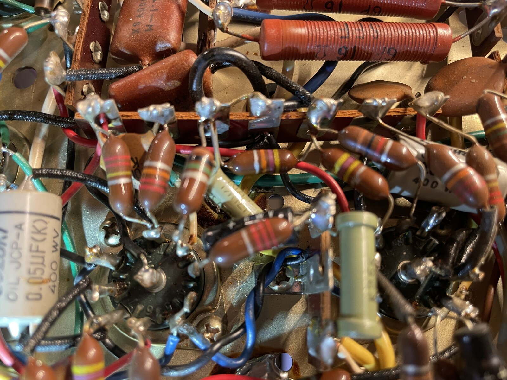
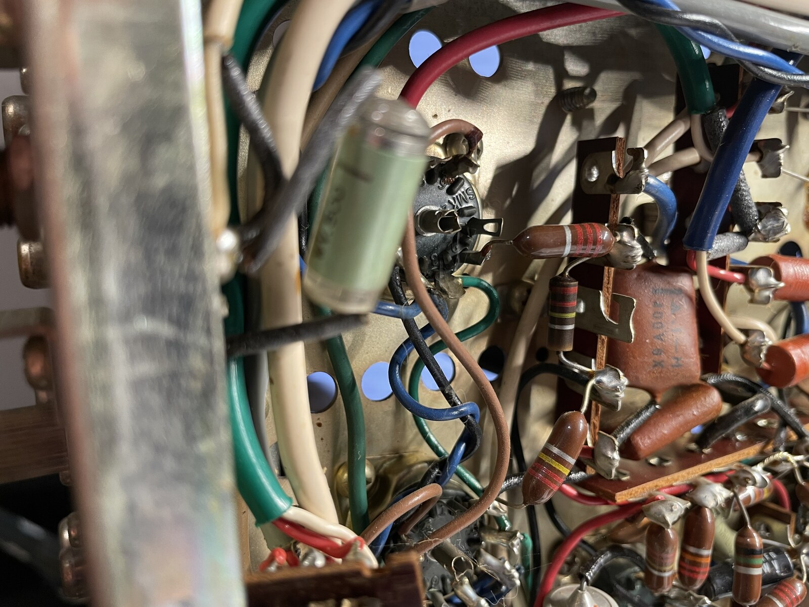

#+TITLE: ER-420 Component Notes
#+CATEGORY: er420
#+STARTUP: overview
#+FILETAGS: :audio:restoration:er420:

Per-component index — one heading per designator, for fast lookup at
the bench: what it does, and which photos it's been physically
identified in. Complements [[file:schematic/circuit-notes.org][circuit-notes.org]] rather than duplicating
it: that file is the subsystem-level investigation journal (the "how
did we figure this out" narrative); this file is the atomic "what do
I know about this one part" layer, same relationship circuit-notes.org
already has to [[file:schematic/ZONES.org][ZONES.org]]. Function lines here stay short and link back
to circuit-notes.org for the full story where one exists.

A heading here is what makes a component's Ref a link in bom.org — a
component doesn't need both Function and Photos filled in to earn a
heading, either is enough to be worth a lookup.

Add photo bullets with [[file:scripts/import-labels.sh][import-labels.sh]] after tagging a photo in
labelme; add Function lines by hand as circuit tracing turns them up.

* C94
Function: AC-line safety bypass cap, one leg to chassis. Physically
located near the fuse holder — see [[file:er-420-restoration-plan.org][restoration-plan.org]] Phase 2 for
the still-open Y2/X2/line-to-neutral trace question.

Photos:
- [[file:photos/2026-07-28-fuse-holder-c94-c95-01.jpg]]

* C95
Function: AC-line safety bypass cap, paired with C94. Same open trace
question — see [[file:er-420-restoration-plan.org][restoration-plan.org]] Phase 2.

Photos:
- [[file:photos/2026-07-28-fuse-holder-c94-c95-01.jpg]]

* C96
Function: arc-suppression cap bridging S10's switch contacts, not a
line-to-chassis safety cap as first guessed. Resin/film construction,
not oil-paper — decided not to replace. Full story in
[[file:schematic/circuit-notes.org][circuit-notes.org]] Power supply.

* C99
Function: one of two 3-section B+ filter/decoupling cans, cascaded
down the power supply's dropping-resistor chain rather than all three
sections tapping one node. Four terminals: one common/negative plus
one per section. Full trace in [[file:schematic/circuit-notes.org][circuit-notes.org]] Power supply.

* C100
Function: matches C99 — see that entry and
[[file:schematic/circuit-notes.org][circuit-notes.org]] Power supply.

Photos:
- [[file:photos/2026-07-28-fuse-holder-c94-c95-01.jpg]]

* C101
Function: series voltage-doubler cap with C102, fed from T9's
dedicated 130V AC winding via D3/D4 — a separate, lower-current supply
from the main B+ chain. D3 lands on its hot ("+") side. Full topology
in [[file:schematic/circuit-notes.org][circuit-notes.org]] Power supply.

Photos:
- [[file:photos/2026-07-28-fuse-holder-c94-c95-01.jpg]]

* C102
Function: the ground-referenced half of the C101/C102 doubler pair —
its negative terminal is where D4 lands. Confirmed as the rear-panel-
closest can, matching the manual's own layout diagram. See
[[file:schematic/circuit-notes.org][circuit-notes.org]] Power supply.

Photos:
- [[file:photos/2026-07-28-fuse-holder-c94-c95-01.jpg]]

* D3
Function: doubler rectifier diode (SD-1A), feeds C101's hot side from
T9's 130V winding. Schematically at I11, off T9. Full trace in
[[file:schematic/circuit-notes.org][circuit-notes.org]] Power supply.

Photos:
- [[file:photos/2026-07-28-fuse-holder-c94-c95-01.jpg]]

* D4
Function: doubler diode (SD-1A) paired with D3, grounds C102's
negative side. Same zone and story as D3 — see
[[file:schematic/circuit-notes.org][circuit-notes.org]] Power supply.

Photos:
- [[file:photos/2026-07-28-fuse-holder-c94-c95-01.jpg]]

* S9
Function: rear-panel line voltage selector (115V/230V). The locking
plate pinning it to 115V is factory original, not a field addition —
see [[file:schematic/circuit-notes.org][circuit-notes.org]] Power supply for the patina/export-market evidence.

Photos:
- [[file:photos/2026-07-28-fuse-holder-c94-c95-01.jpg]]

* T9
Function: main power transformer. Primary identified by tracing to
S9 (white/orange/yellow/red); everything else on the same physical
side is secondary despite the shared side — position alone doesn't
predict primary vs. secondary on this part. Full lead tracing in
[[file:schematic/circuit-notes.org][circuit-notes.org]] Power supply.

Photos:
- [[file:photos/2026-07-28-fuse-holder-c94-c95-01.jpg]]

* VR5
Function: heater hum-balance pot for V1's heater supply — not
cathode-related despite a "(K)" schematic symbol that looks like it
should mean cathode. See [[file:schematic/circuit-notes.org][circuit-notes.org]] Power supply for why.

* VR6
Function: matches VR5, for V2's heater. See
[[file:schematic/circuit-notes.org][circuit-notes.org]] Power supply.

* R77
Function: 100Ω, part of the headphone-output divider with R79, tapping
in *before* S8 (speakers on/off) — the reason "speakers off" doesn't
create a true open-secondary condition on T7. See
[[file:schematic/circuit-notes.org][circuit-notes.org]] Output stage.

* R78
Function: right-channel mirror of R77, paired with R80 for T8. See
[[file:schematic/circuit-notes.org][circuit-notes.org]] Output stage.

* R79
Function: 16Ω wirewound (manual says 10Ω; physical part disagrees,
trusted) — dummy-load resistor keeping T7 loaded when S8 is off, part
of the same divider chain as R77. See
[[file:schematic/circuit-notes.org][circuit-notes.org]] Output stage.

* R80
Function: right-channel mirror of R79, for T8. See
[[file:schematic/circuit-notes.org][circuit-notes.org]] Output stage.

* T7
Function: left-channel output transformer. Primary leads (red/green)
traced directly to V6/V7 plate pins; no-load damage check came back
clean. See [[file:schematic/circuit-notes.org][circuit-notes.org]] Output stage.

* T8
Function: right-channel mirror of T7. See
[[file:schematic/circuit-notes.org][circuit-notes.org]] Output stage.

* C13
Function: 0.05µF oil-paper coupling cap in the Tape Monitor path via
S3 — was briefly suspected of being C96 before tracing ruled that out.
See [[file:schematic/circuit-notes.org][circuit-notes.org]] Tone/preamp.

* C14
Function: right-channel mirror of C13. See
[[file:schematic/circuit-notes.org][circuit-notes.org]] Tone/preamp.

* R73
Function: 2.2K grid resistor feeding V6's control grid (pin 2) from
the driver stage, alongside coupling cap C49.

* C49
Function: 0.1µF Mylar grid-coupling cap, driver stage to V6's grid —
the highest-consequence coupling position in the amp (leak here red-
plates an output tube directly). Tested clean 2026-07-29, in-circuit
DC leakage check.

Photos:
- 
- 
* C50
Function: mirrors C49, feeds V7's grid. Tested clean.

Photos:
- 
* C51
Function: mirrors C49, feeds V8's grid. Tested clean.

* C52
Function: mirrors C49, feeds V9's grid. Tested clean.

* C9
Function: 0.1µF Mylar coupling cap, same value family as C49-C52 but
earlier in the signal chain. Tested clean 2026-07-29.

* C10
Function: right-channel mirror of C9. Tested clean.

* C21
Function: 0.1µF Mylar coupling cap. Tested clean 2026-07-29.

* C22
Function: right-channel mirror of C21. Tested clean.

* S1
Function: input selector. Not a single physical block on the
schematic — four disconnected wafer sections spread across the sheet,
which is why it has no single Zone in bom.org. See
[[file:schematic/circuit-notes.org][circuit-notes.org]] Selector switch.
* VR2
** The 10:00, 12:00, and 2:00 Terminals (The Standard Trio):
Potentiometers are traditionally laid out in a sequence: - Counter-Clockwise/Low (CCW) - Wiper - Clockwise/High (CW).
- 10:00 (CCW / Ground): Tying this terminal to the chassis on both layers
  confirms it is the bottom outer leg of the schematic.
- 12:00 (Wiper): Sitting right between the input and ground, this is physically
  and logically the wiper that sends the volume-adjusted signal onward to the
  grid (pin 2) of the 12AX7 tube.
- 2:00 (CW / Input): Connecting directly to the balance pot (VR1) confirms this
  is the top outer leg (the signal input).
- The 6:00 Terminal (The Loudness Tap): Manufacturers intentionally placed the
  extra loudness tap on the opposite side of the casing (at 6:00) to isolate it
  from the main three terminals and to line it up physically with the lower
  third of the internal carbon resistive element. Your trace to the
  0.02uF capacitor matches the schematic perfectly.
** The 4-Step DMM Test Plan
Perform these tests on both layers of the pot separately.

Keep the amplifier unplugged.

1. Test the Total Resistance (Health of the Carbon Track)
   - Action: Connect your DMM probes to the 10:00 (Ground) and 2:00 (Input) terminals.
   - What to look for: You should see a steady reading close to the schematic value of 500k\(\Omega \) (typically within \(\pm20\%\), so roughly 400k\(\Omega \) to 600k\(\Omega \)).
   - Fail Sign: An "OL" (Open Loop) or megohms-range reading means the carbon track is physically cracked or burned out.
2. Test the Ground Reference (Crucial for the "Always Loud" Symptom)
   - Action: Connect one probe to the 10:00 (Ground) terminal and the other to a bare metal spot on the chassis.
   - What to look for: The reading must be 0 \(\Omega \) (or less than 1 \(\Omega \)).
   - Fail Sign: Any resistance here means the ground path is broken. If the pot's ground tab isn't making solid contact with the chassis or ground bus, the volume cannot turn down to zero.
3. Test the Wiper Sweep (Health of the Contact)
   - Action: Connect your probes to the 10:00 (Ground) and 12:00 (Wiper) terminals. Slowly turn the volume knob from fully counter-clockwise (off) to fully clockwise (max).
   - What to look for: The resistance should rise smoothly from 0 \(\Omega \) up to 500k\(\Omega \).
   - Fail Sign: If the numbers jump erratically, flash "OL", or stay stuck at a high resistance even when turned all the way down, the wiper contact inside is bent, heavily oxidized, or the track is destroyed.
4. Test the Loudness Tap
   - Action: Connect your probes to the 10:00 (Ground) and 6:00 (Loudness Tap) terminals.
   - What to look for: You should get a fixed resistance reading that does not change when you turn the volume knob. It is usually around 100k\(\Omega \) to 150k\(\Omega \) (representing the lower 20–30% of the total track resistance).
   - Fail Sign: An "OL" reading means the delicate physical rivet holding the loudness tap to the carbon track has sheared off inside.
*** Layer 1 results
1. testing ground to input, i'm reading 420k. it is slowly climbing, which is probably an inline capacitor charging with my dmm's batteryi
2. I have confirmed that ground terminal to chassis is 0 ohm -- continuity
3. excellent! wiper to ground goes from about 20 ohms all the way up to 425k ohms pretty smooth
4. loudness to ground test about 212k and doesn't change with turning the knob that's all for one of the layers.
*** Layer 2 results
1. ground to input is about 402k
2. ground to chassis is continuity
3. wiper to ground is not as smooth. it peaks at about 425k, but at max volume it actually drops to 390k
4. ground to loudness is constant at about 202k
** Interpretation
1. The Carbon Track is Healthy (420kΩ)A reading of 420kΩ is well within the standard \(\pm20\%\) tolerance of a vintage 500kΩ potentiometer. The slow climbing behavior absolutely confirms your suspicion: the DMM battery is charging an inline coupling capacitor in the circuit. This tells us the carbon track itself is physically intact and not cracked.
2. The Chassis Ground is Solid (0Ω)Because you have true continuity between the 10:00 terminal and the chassis, we can officially rule out a broken external ground connection. The volume should be able to pull down to zero.
3. The Wiper Sweep is Excellent (20Ω to 425kΩ)The smooth sweep from just 20Ω up to the maximum resistance means your DeoxIT treatment worked beautifully. The internal wiper brush is making solid, continuous contact with the carbon track. More importantly, 20Ω is low enough to completely quiet the audio signal.

The Diagnostic Clue: The Loudness Tap Reading (212kΩ)This is where the mystery
gets solved. A reading of 212kΩ from the 6:00 tap to ground is remarkably
high—it represents about 50% of the total pot resistance. Usually, loudness taps
are placed much lower down the track (around 20% to 30%, which would be roughly
80kΩ to 150kΩ on a 500kΩ pot).Because your DMM is measuring the pot in-circuit
(without unsoldering the wires), this high 212kΩ reading strongly indicates that
your loudness switch circuit or an inline resistor/capacitor is back-feeding
resistance into your measurement.

Why the Amp Played Loudly at "Zero" VolumeSince your wiper sweeps smoothly down
to 20Ω, the pot physically is capable of grounding out the signal. The fact that
it stayed loud and distorted means DC voltage is likely leaking into the volume
control from somewhere else in the amp.When a vintage coupling capacitor (like a
paper-in-oil or old ceramic cap) leaks DC voltage from a previous tube stage
onto the volume pot, it does two things:It bypasses the audio ground, keeping
the volume loud even when turned down.It forces DC current through the grid of
the next tube stage, instantly biasing it into severe, clipping distortion the
moment you turn the knob

The Strange Wiper Sweep (425kΩ Peak dropping to 390kΩ)The behavior where the
resistance peaks right before the end of the rotation and then drops back down
to 390kΩ at maximum volume is actually a known quirk of vintage potentiometers.

- The Cause: This happens when the silver/carbon "termination pad" (the physical
  contact pad welded to the input terminal inside the pot) overlaps slightly
  with the main resistive carbon track. As the wiper transitions from the
  high-resistance carbon track onto the low-resistance silver termination pad,
  you get a slight dip in the DMM reading.

- Verdict: This is normal for vintage construction and is not causing your
  "always loud" or distortion symptom.

** The Final Verdict on the Potentiometer
Your volume pot is healthy enough to function safely and quietly. The DeoxIT did
its job. Because the wiper goes all the way down to a negligible resistance
(~20Ω), the potentiometer itself is not the reason the amplifier was blasting
audio at zero volume.
