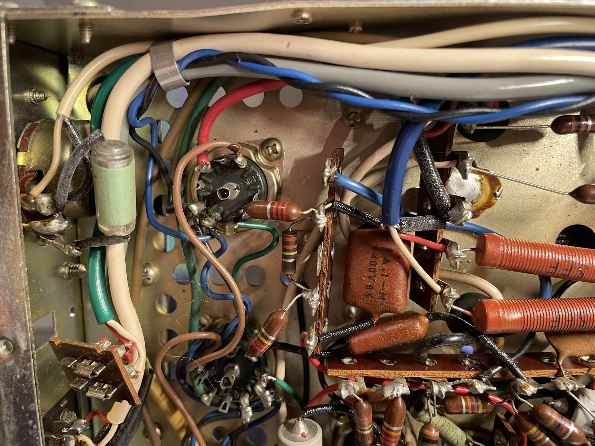

#+nITLE: Pioneer ER-420 Restoration — Plan of Attack
#+CATEGORY: er420
#+STARTUP: overview lognotedone
#+TODO: TODO NEXT BLOCKED | DONE SKIPPED
#+FILETAGS: :audio:restoration:er420:

* Standing rules                                                  :safety:

Read before every session.

- B+ is ~340 V DC. Filter caps hold charge after unplugging.
- Discharge and verify at the start of *every* session, not just the
  first. Powering up between sessions recharges everything.
- Caps are not the only place high voltage sits — tube socket pins and
  terminal strips are all exposed in a point-to-point chassis.
- One hand behind your back whenever the chassis is live.
- Never power up with the output transformer secondary open.
- Never work tired. Most damage happens in the last twenty minutes.
- Never upsize the fuse. A blowing fuse is information.

* DONE Phase -1 — Schematic Prep [8/8]

** DONE 1. Extract page 2 as a high-res raw image
Done 2026-07-28: cropped in Preview to just the schematic (confirmed
against the PDF's embedded scan — native 600 PPI, so this is the true
resolution ceiling, not an arbitrary choice), exported to
=schematic/raw/er-420-schematic.png= at 5623 x 4061px / 600 DPI. This
file is now untouchable going forward.

** DONE 2. Pick a grid size and test it
Done 2026-07-28: 12 x 9 (validated against the 1500px tile ceiling
before running, not just eyeballed) — cell 468 x 451px. Checked
against the actual sheet; legible, cell boundaries land sensibly.

** DONE 3. Generate the real grid
=schematic/er-420-schematic-grid.png= and =-cells.png= written.
=grid.sh= needed a =-font= fix first — ImageMagick had no font
database registered on a fresh Homebrew install (=magick -list font=
came back empty); pointed it at a real font file directly
(=/System/Library/Fonts/Supplemental/Andale Mono.ttf=) rather than
relying on name resolution.

** DONE 4. Record the grid in [[file:schematic/ZONES.org][ZONES.org]]
12 x 9, cell 468 x 451.

** DONE 5. Choose tile size and stride, respecting the 1500px limit
Kept =tiles.sh='s defaults — 3x3 cells, stride 2 — since 12x9 was
chosen specifically to keep 3x3 tiles under the ceiling (1404 x
1353px, confirmed after generation).

** DONE 6. Generate tiles
20 tiles written to =schematic/tiles/=. Spot-checked one
(tile-C1-E3) — every component value and designator reads cleanly at
full resolution.

** DONE 7. Walk the whole sheet, fill in [[file:schematic/ZONES.org][ZONES.org]]'s subsystem table
Done 2026-07-28, all 24 tiles (including 4 supplementary ones — the
original 20 missed column 12 entirely, tiles.sh's coverage math
doesn't reach the last column at 12 cols/3-cell tiles/stride 2).

Two real findings, not just filled-in ranges: "Phono EQ" isn't a
separate block — phono jacks feed a plain resistor divider straight
into the shared preamp, no RIAA network to point to, needs proper
tracing whenever phono work resumes. And S1 (input selector) is drawn
in four disconnected wafer sections spanning nearly the whole sheet
(C1 to G7) — no single zone for it.

** DONE 8. Point [[file:schematic/ZONES.org][ZONES.org]] at the tiles covering what's in scope
Done 2026-07-28: no separate =sections/= crops needed — the
generated tiles already cover everything at a legible size, so this
became listing which =tiles/= filenames cover each in-scope
subsystem (power supply, tone/preamp, driver, output stage) directly
in [[file:schematic/ZONES.org][ZONES.org]], rather than cropping duplicate copies onto disk.

* TODO Phase 0 — Before the cover comes off [3/4]

** DONE 1. Do not plug it in
Not even to "see if it works." A cold mains start on degraded caps is
the single most likely moment to lose T9 or an output transformer.
Honored throughout — hasn't been powered on since acquisition.

** TODO 2. Build or borrow a dim bulb tester
Socket + plug + outlet + 100 W incandescent in series with the hot
leg. Receiver draws roughly 130–150 W, so a 100 W bulb limits usefully
without being uselessly restrictive.

** DONE 3. Keep the schematic visible while working
Corrected 2026-07-28: originally planned as a large paper printout to
mark up by hand. In practice a dedicated laptop screen shows the PDF
continuously at the bench, and bom.org's Status column (spec/keep/
ordered/installed) is the progress tracker and error check instead of
highlighter marks on paper.

** DONE 4. Set up a photo workflow
Phone is fine. Consistent angles, good light, more shots than feel
necessary. You will be referring back to these for weeks.
import-photos.sh, running since the first teardown session.

* DONE Phase 1 — Access and make safe [5/5]

** DONE 1. Unplug. Wait.
** DONE 2. Remove case / bottom cover
Corrected 2026-07-28: top case screws are flathead, not JIS — the
JIS assumption in this plan was wrong, worth double-checking any
other screw-type assumptions the same way rather than trusting them.
Bag and label screws by location.

Factory paint-dot seals intact on all top case screws — never been
removed before. Good originality sign, at least for the top case.

** DONE 3. Discharge every capacitor section
- C99 and C100 are 40+20+20 cans: *four lugs each* — one common/
  negative (confirmed via chassis continuity, not wire color — see
  [[file:schematic/circuit-notes.org][circuit-notes.org]]) plus one per section. Discharging one section
  does nothing for the others.
- Also C98, C101, C102, C11, C12, C61.
- Clip discharge pen lead to bare chassis, probe each lug.
- Done 2026-07-28: all read dead, no residual charge anywhere.

** DONE 4. Verify with DMM on DC volts
The pen's LED is an indicator, not proof. Read every lug.

** DONE 5. Wait 5 minutes, re-measure
Dielectric absorption: old caps recover charge as the dielectric
relaxes.

* TODO Phase 2 — Survey before touching anything [8/15]

Goal: answer every open question, then place the second parts order.

** DONE 1. Photograph the entire underside
CLOSED: [2026-07-28 Tue 22:50]
- CLOSING NOTE [2026-07-28 Tue 22:50] \\
   series (18 shots) covers it. May add
  more if specific sections need closer coverage later.
Overlapping shots. Every terminal strip, every tube socket, both
transformers, the whole power supply area.

** DONE 2. Check for prior repairs
Modern-looking parts, mismatched solder, hacked wiring, non-original
values. If someone has been in here, the manual is no longer ground
truth.

CLOSED: [2026-07-28 Tue 22:45]
- CLOSING NOTE [2026-07-28 Tue 22:45] factory paint-dot seals, resistors are
  consistently one brand, caps match within their class, wiring is consistent
  throughout — nothing replaced or substituted. The loose knobs re-tightened at
  the post (history.org) are a minor adjustment, not a repair — nothing was
  swapped out.

** DONE 3. Inspect T7/T8 output transformers for no-load damage
CLOSED: [2026-07-28 Tue 23:43]
- CLOSING NOTE [2026-07-28 Tue 23:43] \\
  measured primary center to both other primary ends and got consistent readings. measured primary to secondary terminals and got growing values. on both t7 and t8
At acquisition, S8 (front Speakers ON/OFF) may have been left off
while the amp was powered — no speaker load on the output, a real
risk to output transformer insulation. Also known from that night: L
and R channels each worked individually but not at the same time, and
the volume pot caused heavy distortion at the slightest turn-up from
zero. See [[file:history.org]] for the full account. Look for anything
consistent with an arc or insulation breakdown before assuming these
symptoms are just dirty contacts.

** DONE 4. Identify C99 and C100 physically
CLOSED: [2026-07-28 Tue 22:44]
- Twist-lock or clamp mount?
- Confirm three lugs each.
- *Is the can body the negative return?* Determines how a discrete
  rebuild has to be grounded.
- Measure available space around them.

** DONE 5. Measure clearance at C101 / C102
CLOSED: [2026-07-28 Tue 22:49]
- CLOSING NOTE [2026-07-28 Tue 22:49] \\
  Incoming parts are 18 × 25 mm. Note original size and orientation.
** DONE 6. Verify C94, C95 identity, then pull
CLOSED: [2026-07-29 We  d 01:12]
- CLOSING NOTE [2026-07-29 Wed 01:12] \\
  Found C94 and C95. I'm not pulling them until I finish inspection and actually
  do the 3-wire conversion.

3-wire conversion decided — these come out and stay out regardless of
where exactly they sit. Visually confirm they're actually C94/C95
(0.002µF +100%/-0% 1400V per the manual) before yemoving anything, so
nothing else gets mistaken for them.

** TODO 7. Trace C96
Still the open decision point. Three outcomes:
- *Line-to-chassis* → needs a Y2-rated safety cap. Nothing ordered
  for this yet — the X2 part on hand does not cover this duty; would
  need to source a proper Y2 part first.
- *Line-to-neutral* → X2-rated. Candidate already on hand: KEMET
  PHE840MK5470MK04R17 (280V, 0.047µF, X2).
- *Elsewhere* (ordinary coupling position) → covered by the standard
  630V film batch already ordered (667-ECW-FD2J473J4).

** DONE 8. Inspect the line cord
CLOSED: [2026-07-28 Tue 22:51]
- CLOSING NOTE [2026-07-28 Tue 22:51] \\
  looks fine though it will get replaced later. the strain releif might be tight
  for a 3 wire though
Flex along its length. Stiff, cracked, or crazed → replace. Supple and
intact → optional.

** DONE 9. Decide: 2-wire or 3-wire grounded conversion
Decided 2026-07-28: 3-wire. Gates C94/C95's removal and the rest of
the safety cap disposition — see Phase 4.

** TODO 10. Verify R77/R79/R80 connection point
Do the headphone divider resistors tap in *before* or *after* S8? If
before, the secondary always sees ~100 Ω and "speakers off" is safe
with nothing plugged in. If after, it does not.

Manual's parts list shows R77/R78 = 100 Ω composition, R79/R80 = 10 Ω
5W wirewound — a different pairing than "R77/R79/R80" implies. Confirm
which resistors actually form the divider by tracing the schematic
before relying on this grouping.

** TODO 11. Inventory tubes
Confirm all present and correct types per the parts list. Note any
substitutions. Check for obvious shorts with the DMM.

** TODO 12. Test C49, C50, C51, C52 (0.1 µF Mylar)
*Priority.* These feed the output tube grids directly. You have no
replacements. If any leak, order before you get further.

** TODO 13. Test remaining Mylars
C9, C10, C21, C22 (0.1 µF) — audio chain, in scope.

** TODO 14. In-circuit resistor sweep
In-circuit readings can only read *low*, never high — parallel paths
add conductance. So anything reading *above* nominal is definitively
drifted. Flag those, lift one leg to confirm.

Expect worst drift at: 2.2M (R19, R20, R33, R34, R90, R94, R127), 2M
(R15, R16), 4.7M (R123, R124), and anything running hot — R111–R117.

** TODO 15. Place second parts order
Resistors (measured values, correct wattage, high-voltage rated for B+
positions), safety caps per the grounding decision, C99/C100 solution,
0.1 µF films if the Mylars failed, wire, sleeving, hardware.

* TODO Phase 3 — Clean before you solder [0/4]

** TODO 1. Blow out dust
Compressed air, outdoors. Sixty years of it.

** TODO 2. DeOxit all switches
S1 input selector (multi-wafer, both tuner and audio sections), S2 mode,
the seesaw switches, S7, S8, S9, S10. Apply, then *exercise 20–30 times*
— the mechanical action does the work, not the fluid.

** TODO 3. DeOxit all pots
VR1 balance, VR2 volume, VR3 treble, VR4 bass. Rotate through full
travel repeatedly.

** TODO 4. Clean tube pins and sockets
Pull each tube, note position, clean pins, reseat. Poor socket contact
is a top cause of noise and intermittents.

* TODO Phase 4 — Power supply [0/9]

Do this first. Everything downstream depends on it, and you want a
known-good supply before evaluating anything else.

** TODO 1. Line cord / grounding
If converting to 3-wire:
- Green wire to a *dedicated* chassis bolt. Star washer to bite
  through paint. Not shared with a transformer mount.
- *Fuse and switch must land in the hot leg.* Trace which side S10 and
  the fuse holder are in — with the old unpolarized plug there was no
  defined hot side.
- Ground the AC convenience outlet too, and check its polarity.
- Verify: < 1 Ω chassis to ground pin; no continuity line pin to
  chassis.

** TODO 2. C101, C102 → 100 µF 350 V Nichicon
Observe polarity. Stripe = negative, long lead = positive.
Note: likely a voltage doubler, each cap sees ~190 V.

** TODO 3. C98 → 22 µF 450 V

** TODO 4. C99, C100
Chosen approach: Discrete (47 µF + 22 µF + 22 µF per can)
- Discrete: 47 µF + 22 µF + 22 µF per can. *Recreate the shared
  negative return at the original chassis point* — moving it invites
  hum. Support mechanically; don't leave them hanging on leads.
- Restuff: gut can, fit radials inside, reinstall.
- Hayseed / CE Mfg: bolt-in, no decisions.

** TODO 5. C94, C95 — remove
Come out and stay out under the 3-wire conversion. Pending only the
Phase 2 visual ID check, not a trace.

** TODO 6. C96 — install per Phase 2 trace result
Whichever of the three Phase 2 outcomes applies: Y2 (not yet sourced),
X2 (PHE840MK5470MK04R17, in hand), or the standard 630V film (in
hand, part of the batch order).

** TODO 7. C11, C12 → 22 µF 450 V
** TODO 8. C61 → 10 µF 450 V
** TODO 9. New 2 A slow-blow fuse

* TODO Phase 5 — First power-up [0/6]

Nothing else gets replaced until the supply checks out.

** TODO 1. Visual inspection
Every new joint. Every polarity. Look for solder splash, stray strands,
leads touching what they shouldn't.

** TODO 2. Power up on the dim bulb tester
Tubes installed. *Do not pull tubes to "protect" them* — less load
means higher B+ on everything else.

Bulb flashes bright then dims = normal inrush. Bulb stays bright =
fault. Kill it immediately.

** TODO 3. Watch and smell for 30 seconds
Smoke, arcing, unusual noise, hot smell. Kill power at anything odd.

** TODO 4. Measure B+ rails against the schematic
Main rail ~340 V. Work down the chain: R111 → R112/R113 → R114/R115 →
R116/R117, each followed by a cap section, each a lower rail.

Note the schematic's voltages are AM/FM pairs, no input signal,
measured with a VTVM. Your DMM will read slightly high on
high-impedance nodes.

** TODO 5. Measure output tube cathode voltage
Across R75 and R76 (150 Ω 4 W). Schematic says ~11 V, roughly 73 mA per
pair. Substantially high = a tube or a leaking coupling cap.

** TODO 6. Only after all rails check out: run without the bulb limiter

* TODO Phase 6 — Audio chain [0/5]

Method matters more than speed.

** 1. Technique
- *One capacitor at a time.* Remove, replace, verify, mark the
  schematic. Never bulk-remove.
- Photograph each position before removal.
- Add fresh solder to the old joint before desoldering — sixty-year-old
  joints are oxidized and won't flow otherwise.
- Keep leads short. Don't disturb adjacent wiring.
- Film caps are non-polarized; orientation doesn't matter.
- Electrolytics *are* polarized. Check twice.
- Use the *same part* for both halves of a channel pair.

** TODO 2. Coupling caps — the priority group
Leaky oil paper puts DC on a grid and red-plates output tubes.

| Value    | Positions                                        |
|----------+--------------------------------------------------|
| 0.022 µF | C7, C8, C19, C20                                 |
| 0.047 µF | C13, C14, C25, C26, C47, C48, C56, C60, C70, C96 |

** TODO 3. Cathode bypass caps → 47 µF 50 V
C23, C24, C43, C44, C53, C54.
C53/C54 sit across the output cathode resistors and pass real AC
current — low-impedance parts are a genuine benefit there.

** TODO 4. C88 → 4.7 µF 50 V
** TODO 5. Mylars that failed Phase 2 testing
** TODO 6. Drifted resistors from the Phase 2 sweep
Metal film. 1/2 W minimum, 1 W or high-voltage rated on B+ positions —
watch the *voltage* rating, not just wattage. A 1/4 W part maxes around
200–250 V regardless of the power math.

* TODO Phase 7 — Output section decision [0/1]

** TODO 1. S7 impedance switch
Reported physically broken at acquisition — loose, would slide and
also push in, felt nearly broken off. Never opened up to confirm. See
[[file:history.org]]. This isn't really an open choice anymore so much as
confirming what's already suspected:
- DeOxit and keep — preserves 8 Ω flexibility, only sensible if it
  turns out not to actually be broken
- Hardwire to 16 Ω — removes a contact from the highest-consequence
  path in the receiver, and the likely call given the damage report

If hardwiring: *confirm which tap is which by measurement*, not by wire
color. 16 Ω tap has more turns and higher DC resistance. S7 is two
sections (S7 1/2, S7 2/2) — both channels.

* TODO Phase 8 — Commission [0/6]

** TODO 1. Power up, aux input, low volume
Known-good source. Listen before measuring.

** TODO 2. Hum check
Volume at minimum, nothing connected. Hum here is power supply or
heater-to-cathode leakage — *not* a grounding problem.

** TODO 3. Adjust VR5, VR6 hum balance
100 Ω humdingers on the V1/V2 heater supply — the phono input tubes.
Adjust for minimum hum on phono.

** TODO 4. Channel balance and separation
** TODO 5. Connect turntable
Ground wire to the receiver's ground terminal first. Hum with it
connected but silence without = ground loop, not a floating arm.

** TODO 6. Exercise every switch and pot again
Second DeOxit pass now that everything is warm and settled.

* TODO Phase 9 — Deferred [1/3]

** TODO 1. Tuner section health check
Not alignment — just condition. Tubes not shorted, no obviously failed
caps. It shares the power supply, so a fault there reaches the audio
section.

** SKIPPED 2. Tuner alignment
Requires signal generator, VTVM, oscilloscope, and a multiplex
generator. Not doing this for a turntable-only use case.

** TODO 3. Cosmetics, dial cord, lamps
Dial cord stringing diagram is on p.2 of the manual if needed.

* Session log

Append as you go. Date, what changed, what you measured, what
surprised you.
