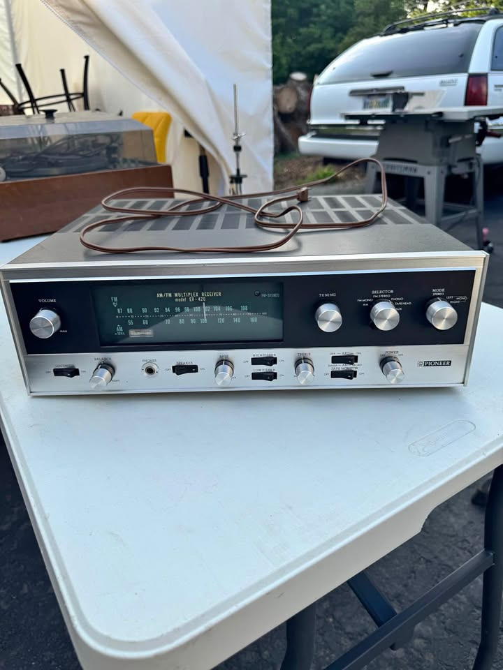
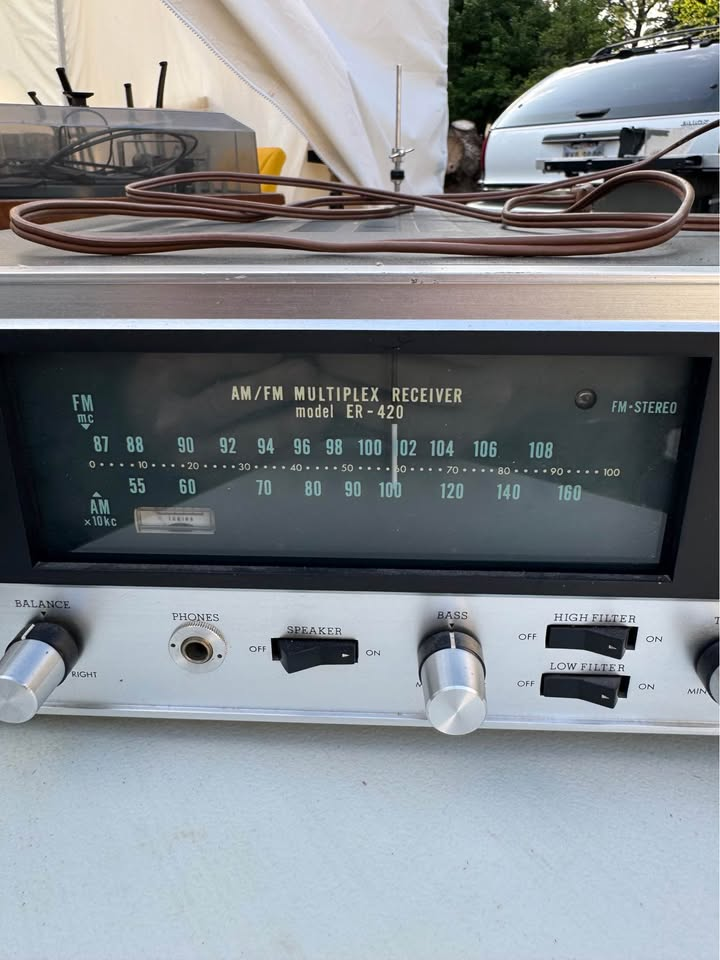
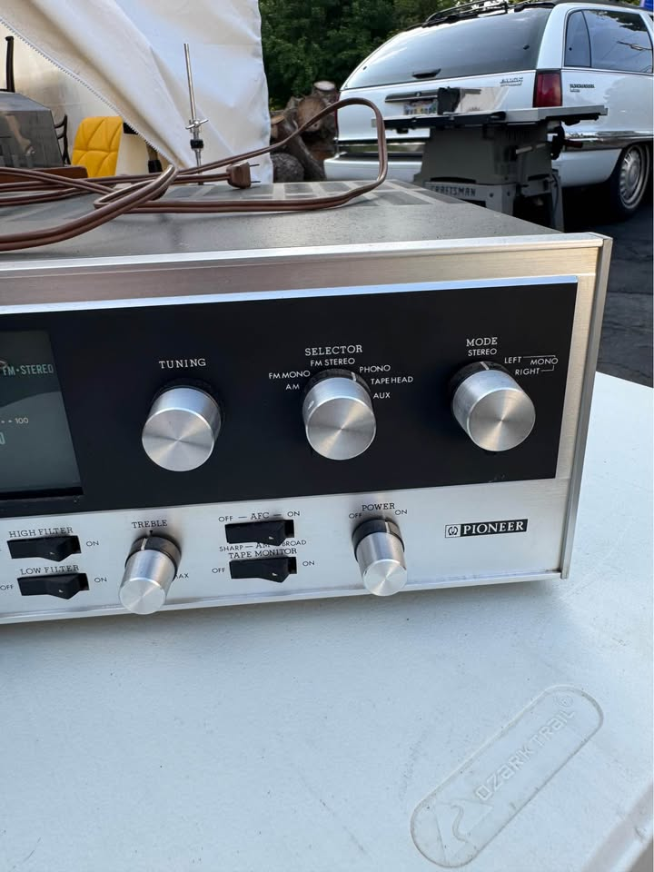
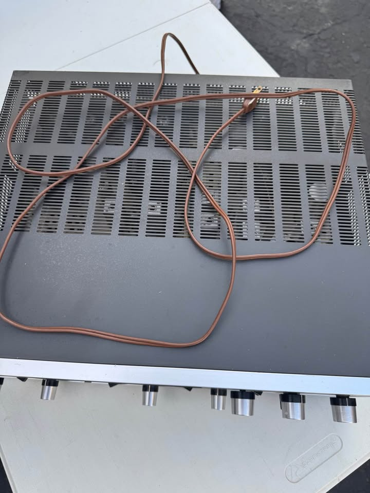
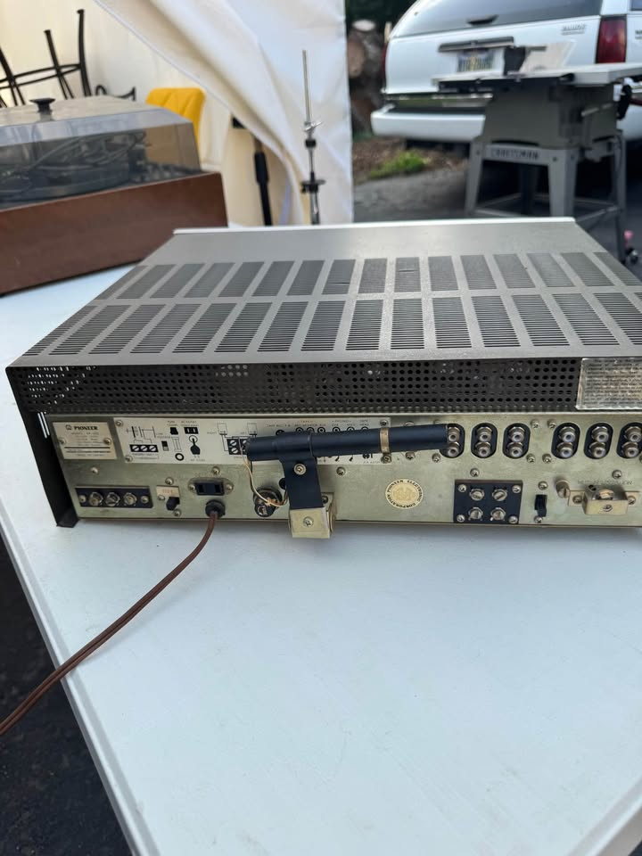
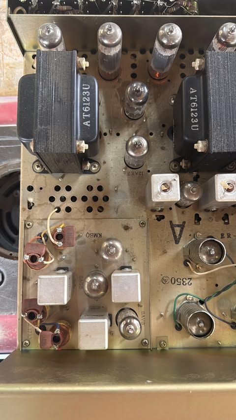
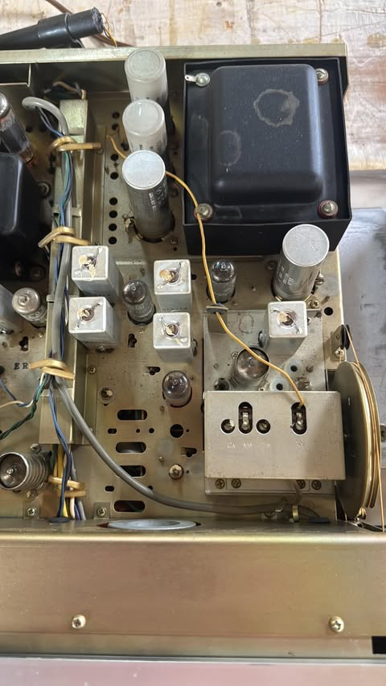
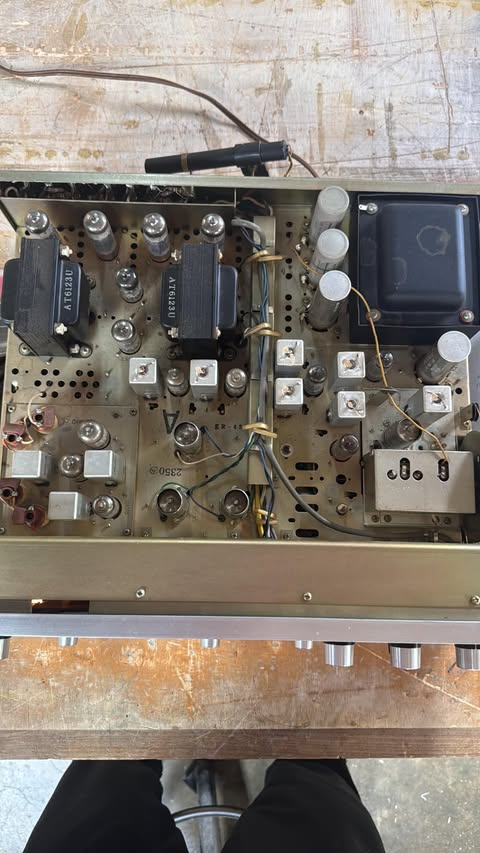

#+TITLE: ER-420 History and Provenance
#+CATEGORY: er420
#+STARTUP: overview
#+FILETAGS: :audio:restoration:er420:

* Acquisition

Bought from David H. via Facebook Marketplace locally in SW Ohio.
Listed at $400; final price $325 for the receiver and a pair of
Pioneer CS-A31 speakers together, reduced from the original ask once
the issues below turned up during testing. Listing condition: "Used -
Good."

A pair of Onkyo HS-204 speakers had come with the receiver from its
original owner but weren't part of this purchase.

Chain of ownership, as far as known: original owner → David → Doug. David told
Doug directly he bought it from the original owner, so this set has had very few
hands on it before now.

David's own listing description: "This is a very clean pioneer ER420
receiver, it does work but with all vintage equipment it should be
restored."

* Pre-purchase conversation with David

Before going to pick it up, Doug asked David what testing he'd done.
David's answer is worth keeping verbatim rather than summarized,
since it's the only real condition information available before
hands-on inspection:

#+begin_quote
Just listened to it. To me it doesn't matter what kind of condition
this vintage equipment is in, it still needs restoration. This one is
super clean inside and out but I'm sure it needs work. I collect
Rotel. I have no knowledge on how to fix them. I've just used mine
enough in unrestored conditions to know somethings not right even
though they play.
#+end_quote

Worth noting: David is a collector himself (Rotel), not a technician
— his read is "it plays, but playing isn't the same as being right,"
which is exactly the same caution this whole project already starts
from. Doug's reply at the time captured the same expectation: that it
playing normally said something about rough condition, but restoration
was assumed regardless.

* Pickup night

At David's shop — he's a professional woodworker with a lot of stored
audio gear around, in variable storage conditions. Went for the
ER-420 and a pair of CS-A31 speakers specifically.

The receiver was already on when Doug arrived, playing FM through one
of the Onkyo speakers — loud, but sounded like FM normally does, and
confirmed the FM path works. A CD player plugged into the AUX input
played fine and sounded good — AUX confirmed too. Acoustics in the
shop were bad and the volume was too high to judge clarity well
either way.

Wired up the CS-A31 speakers to test them. Left and right channels
each worked individually, but not at the same time. There's a front
panel Speakers ON/OFF see'saw switch (S8) that was off at some point
during the evening — possibly while the amp was still powered, which
would mean no speaker load reaching the output at all. Sequence of
events here is fuzzy in memory, but S8 being off while powered is the
likely source of any no-load moment, more specific than just
"speakers may have been unplugged."

Found the rear speaker impedance selector physically damaged — loose,
would slide and also push in, felt nearly broken off. Never opened
the case to look closer. Distortion and popping when manipulating it.
Volume control: turned all the way down, still loud; turning it up
even slightly caused heavy distortion. Most other pots felt fine,
just a little scratchy; the FM tuning was scratchy too. A few knobs
were loose — widened at the post with a screwdriver to tighten them,
a prior field fix, not original.

Tested the CS-A31 speakers separately on a known-good Rotel amp: both
played well and sounded good, which points at the ER-420 rather than
the speakers as the source of the earlier problem. Never got to hear
anything at low volume — David preferred things loud throughout.
Opened one CS-A31 to confirm a fabric surround, not foam.

Because of the volume/distortion issue, the broken impedance
selector, and garbled channel output, the price came down
accordingly. Hasn't been powered on since.

* Photos

Listing photos (David's Marketplace photos, saved before the listing
could disappear):
- 
- 
- 
- 
- 

Internal photos David sent on request, before pickup:
- 
- 
- 

* Still to add

- Exact purchase date (the front-panel photo already in =photos/= is
  dated 2026-07-24, which may or may not be pickup day itself).
